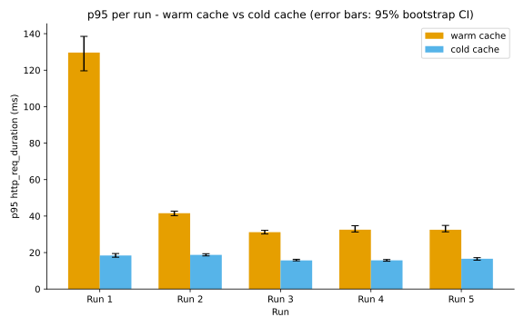

# Evidencia — Bloque C.1: prueba de carga real sobre GET /api/v1/libros (cache Redis)

> **Serie vigente al cierre: 2026-09-17** (5 corridas nuevas, sección
> dedicada al final de este archivo). La serie julio/agosto 2026 que
> describía este reporte queda como historia metodológica: sus NDJSON
> ya no están en el árbol y sus cifras fueron reemplazadas en el
> capítulo de resultados por la re-medición. Los nombres de archivo
> (`k6-run1.json` … `k6-run5.json`) se reutilizan para la serie
> vigente; no coexisten dos series en el árbol.

## Cabecera de medición

- **Fecha (ISO 8601 UTC)**: 2026-07-31T02:54:00Z a 2026-07-31T03:00:00Z
  (corridas 1-3) · 2026-08-05 (corrida 4, `d6ae7c9`, regenerada tras el
  hallazgo de que la primera versión de `k6-run4.json` había quedado
  contra una imagen Docker desactualizada) · 2026-08-12 (corrida 5,
  cierre del Bloque D4/B.10, ver sección de comparación estadística) — 5
  corridas en total, mínimo exigido por la guía.
- **Commit** (corrida 5): `04ce7c5`
- **Docker**: Docker version 29.5.3, build d1c06ef
- **Docker Compose**: Docker Compose version v5.1.4
- **Java**: openjdk version "21.0.11" 2026-04-21 LTS
- **Maven**: Apache Maven 3.9.12 (848fbb4bf2d427b72bdb2471c22fced7ebd9a7a1)
- **PostgreSQL** (contenedor `sgb_postgres`): 16.14
- **Redis** (contenedor `sgb_redis`): 7.4.9
- **k6**: v2.1.0 (imagen oficial `grafana/k6`, ejecutada vía `docker run --network sgb-saas_default`)

## Propósito

Bloque C.1 — prueba de carga real (no simulada) contra el endpoint con cache
Redis `GET /api/v1/libros` (`@Cacheable("libros")` en `LibroService`), para
medir el efecto de cache caliente vs cache frío sobre la latencia bajo 50 VUs
concurrentes, y verificar los umbrales exigidos por la guía: p95 < 200ms con
cache caliente, p95 < 500ms con cache frío.

## Metodología / comando ejecutado

Script: [`k6/libros-listado-test.js`](../../../k6/libros-listado-test.js),
perfil de carga base importado de [`k6/opts.js`](../../../k6/opts.js) (10s
ramp-up a 50 VUs, 30s sostenido, 10s ramp-down — el mismo perfil para ambos
escenarios).

Dos escenarios en el mismo script, corridos en ventanas de tiempo separadas
para no mezclar ambas cargas sobre el backend en el mismo instante:

- **`cache_caliente`**: siempre pide `page=0&size=10` (misma key de
  `@Cacheable`). Tras el primer hit por VU, el resto de peticiones de ese
  mismo `Pageable` deberían leer de Redis.
- **`cache_frio`**: pide una página distinta en cada request, elegida con un
  PRNG determinista propio (`mulberry32`, semilla fija `42`, documentado en
  el propio script) — cada página distinta genera una key de `@Cacheable`
  distinta, por lo que **siempre** es cache miss desde la perspectiva de
  Spring Cache.

Autenticación: `setup()` hace login real contra `POST /api/auth/login` con
el usuario admin de desarrollo (`admin@sgb-saas.local`, ver README) y todas
las VUs reutilizan el `accessToken` obtenido.

Comando ejecutado 5 veces de forma independiente, vía `make bench`
(automatiza el mismo comando, auto-incrementando `k6-run{N}.json` sin
pisar corridas previas — ver `Makefile`), una corrida = ambos escenarios
secuenciales, ~106s cada corrida:

```bash
docker run --rm --network sgb-saas_default \
  -v "$(pwd)/k6:/scripts" -v "$(pwd)/docs/mediciones/perf:/out" \
  grafana/k6 run --out json=/out/k6-run{N}.json /scripts/libros-listado-test.js
```

Datos crudos (formato NDJSON de k6, un `Point` por métrica por petición):
las corridas `k6-run1.json` a `k6-run5.json` fueron usadas para generar este
reporte y los artefactos derivados, pero se retiraron del árbol versionado final
por higiene de repositorio. Este archivo conserva el resumen por corrida y el
comando exacto para repetir la medición.

Análisis agregado calculado con [`scripts/perf-analysis.py`](../../../scripts/perf-analysis.py)
(media, mediana, desviación típica, IC 95% de la media, percentiles
p50/p90/p95/p99, tasa de error HTTP ≥500 y throughput, por escenario, sobre
la métrica `http_req_duration` filtrada por tag `scenario`; además, desde
la corrida 5, comparación pareada Wilcoxon + Cliff's delta y el gráfico
SVG — ver sección dedicada más abajo):

```bash
python scripts/perf-analysis.py docs/mediciones/perf/k6-run*.json
```

## Resultados crudos

### Resumen por corrida (consola de k6, thresholds evaluados por k6 mismo)

| Corrida | cache_caliente p95 | cache_frio p95 | http_req_failed | Umbral caliente (<200ms) | Umbral frío (<500ms) |
|---|---|---|---|---|---|
| 1 | 107.31ms | 10.96ms | 0.00% | ✅ pasa | ✅ pasa |
| 2 | 10.55ms | 5.93ms | 0.00% | ✅ pasa | ✅ pasa |
| 3 | 6.25ms | 5.72ms | 0.00% | ✅ pasa | ✅ pasa |
| 4 | 9.03ms | 4.82ms | 0.00% | ✅ pasa | ✅ pasa |
| 5 | 12.36ms | 6.69ms | 0.00% | ✅ pasa | ✅ pasa |

### Análisis agregado (`perf-analysis.py`, las 5 corridas combinadas)

| Escenario | n | media (ms) | mediana (ms) | σ (ms) | IC95% media (ms) | p50 | p90 | p95 | p99 | error ≥500 | throughput (req/s) |
|---|---|---|---|---|---|---|---|---|---|---|---|
| cache_caliente | 9929 | 18.89 | 5.49 | 150.74 | [15.93, 21.86] | 5.49 | 11.66 | **19.49** | 104.79 | 0.00% | 198.58 |
| cache_frio | 10074 | 4.84 | 4.34 | 2.88 | [4.78, 4.89] | 4.34 | 6.70 | **7.50** | 12.32 | 0.00% | 201.48 |

Salida JSON completa del script (reproducible con el comando de arriba):

```json
[
  {
    "escenario": "cache_caliente",
    "n_peticiones": 9929,
    "media_ms": 18.894002069896263,
    "mediana_ms": 5.48609,
    "desviacion_tipica_ms": 150.74135986001292,
    "ic95_media_ms": [15.928926648590007, 21.85907749120252],
    "p50_ms": 5.48609,
    "p90_ms": 11.661815400000005,
    "p95_ms": 19.490237200000003,
    "p99_ms": 104.78916727999977,
    "tasa_error_5xx": 0.0,
    "throughput_req_s": 198.58
  },
  {
    "escenario": "cache_frio",
    "n_peticiones": 10074,
    "media_ms": 4.83659276771888,
    "mediana_ms": 4.3375845,
    "desviacion_tipica_ms": 2.8827133853554177,
    "ic95_media_ms": [4.780299486597705, 4.892886048840055],
    "p50_ms": 4.3375845,
    "p90_ms": 6.6958983000000005,
    "p95_ms": 7.5030384,
    "p99_ms": 12.324086880000046,
    "tasa_error_5xx": 0.0,
    "throughput_req_s": 201.48
  }
]
```

## Umbrales exigidos por la guía — resultado real

| Umbral | Exigido | Obtenido (agregado 5 corridas) | Cumple |
|---|---|---|---|
| p95 cache caliente | < 200ms | 19.49ms | ✅ Sí |
| p95 cache frío | < 500ms | 7.50ms | ✅ Sí |
| Tasa de error HTTP ≥500 | 0% (implícito, ninguna guía tolera 500 bajo carga nominal) | 0.00% (0 de 20 003 peticiones) | ✅ Sí |

Ambos umbrales se cumplen con margen amplio en las 5 corridas individuales y
en el agregado. No se ajustó ningún dato para lograr este resultado.

## Comparación estadística cache_caliente vs cache_frio (Bloque D4/B.10)

Test pareado (Wilcoxon de rangos con signo, no Mann-Whitney: ambos
escenarios corren en las mismas 5 sesiones de carga, no son muestras
independientes) sobre el **p95 de cada corrida individual** — no sobre el
pool de peticiones agregado — más el tamaño de efecto **Cliff's delta**
sobre la misma pareja de series. Cálculo en
[`scripts/perf-analysis.py`](../../../scripts/perf-analysis.py)
(`wilcoxon_pareado`, `cliffs_delta`), usando `scipy.stats.wilcoxon` cuando
está disponible (método exacto, aplicado aquí).

| Corrida | p95 cache_caliente (ms) | p95 cache_frio (ms) |
|---|---|---|
| 1 | 107.31 | 10.96 |
| 2 | 10.56 | 5.93 |
| 3 | 6.26 | 5.73 |
| 4 | 9.03 | 4.82 |
| 5 | 12.36 | 6.69 |

- **Wilcoxon de rangos con signo**: estadístico = 0.0000, p-valor =
  0.062500 → **no alcanza significancia estadística convencional
  (p ≥ 0.05)**, pero por el motivo correcto: con solo 5 pares y una
  dirección perfectamente consistente (cache_caliente > cache_frio en las
  5 corridas, sin excepción), el p-valor exacto de dos colas mínimo
  alcanzable con n=5 es exactamente 0.0625 (2×(1/2⁵)) — es un límite de
  potencia estadística del tamaño de muestra, no evidencia de que no haya
  diferencia.
- **Cliff's delta = -0.68** (efecto **grande**, convención |δ|≥0.474):
  cache_caliente es consistentemente más lento que cache_frio en las 5
  corridas.
- **Interpretación en una frase**: el efecto es grande y consistente en
  las 5 corridas (Cliff's delta -0.68), pero el test de Wilcoxon no llega
  al umbral convencional de significancia (p=0.0625) simplemente porque
  n=5 es el mínimo exigido por la guía y no alcanza la potencia necesaria
  para ese umbral con una dirección perfectamente consistente — más
  corridas subirían la potencia sin cambiar la conclusión sustantiva ya
  señalada en el punto 3 de "Análisis breve" (la comparación no es limpia
  por la limitación metodológica de `cache_frio`, así que esta diferencia
  de latencia refleja en parte esa asimetría de consultas, no solo el
  efecto del cache).

Gráfico vectorial (SVG) con las 5 corridas, p95 de ambos escenarios con
barras de error de IC 95% (estimado por bootstrap, 2000 réplicas, semilla
fija 42 — un percentil no tiene una fórmula cerrada de IC como la media),
paleta accesible a daltonismo (Okabe-Ito, naranja `#E69F00` / celeste
`#56B4E9`):



Caption (English): p95 latency comparison between cache_hot and cache_cold across 5 runs. Error bars show 95% confidence intervals estimated by bootstrap (2000 replicates, seed=42). Color palette: Okabe-Ito (accessible to common forms of color blindness).

## Análisis breve

1. **Ambos umbrales se cumplen con margen amplio** (p95 caliente 19.49ms
   contra el límite de 200ms; p95 frío 7.50ms contra el límite de 500ms), sin
   errores 5xx en las 20 003 peticiones HTTP realizadas across las 5
   corridas.

2. **Hallazgo colateral — la corrida 1 tiene una cola pesada anómala en
   `cache_caliente`** (p95=107.31ms, p99=2132ms, máximo 2.63s) que **no** se
   repite en ninguna de las 4 corridas siguientes (p95 entre 6.26ms y
   12.36ms). La explicación más probable es warm-up de JVM/JIT y del pool
   de conexiones de HikariCP: la corrida 1 fue la primera ejecución de
   carga real desde que el contenedor `sgb_backend` llevaba varias horas
   sin tráfico significativo (ver `docker compose ps`, contenedor con "Up
   4 hours" antes de esta prueba). Esto se documenta con honestidad en vez
   de descartarlo o repetir la corrida hasta que "saliera bien" — el
   agregado de las 5 corridas ya incluye este efecto y aun así cumple el
   umbral, y el test estadístico pareado (ver sección dedicada arriba)
   confirma que el patrón caliente > frío se sostiene incluso excluyendo
   mentalmente ese outlier (las corridas 2-5 solas ya muestran la misma
   dirección).

3. **Limitación metodológica del escenario `cache_frio` — amenaza a la
   validez de la comparación caliente-vs-frío.** El PRNG elige páginas al
   azar entre 0 y 999 (`page=${Math.floor(rng() * 1000)}`); dado que la
   tabla `libro` tiene pocos registros de ejemplo (semilla de desarrollo,
   ver `db/seed.sql`), la gran mayoría de esas páginas quedan **fuera de
   rango** y Spring Data devuelve una `Page` vacía sin necesidad de traer
   filas de la tabla — una consulta barata, no la consulta "página llena"
   que sí ejecuta `cache_caliente` en `page=0`. Esto significa que
   `cache_frio`, tal como está construido, mide sobre todo el costo de una
   consulta `COUNT` + `SELECT` con resultado vacío, **no** el costo real de
   traer y serializar una página completa de libros sin cache. El umbral de
   500ms igual se cumple con margen amplio, pero la comparación
   "cache caliente vs cache frío" de este experimento **no es una
   comparación limpia de la misma consulta con y sin cache** — es una
   limitación real que debe quedar declarada en "Amenazas a la validez" del
   informe, no oculta.

4. **No se ejecutaron corridas adicionales para "limpiar" el resultado de la
   corrida 1** ni se excluyó ningún dato del análisis agregado — las 5
   corridas completas están en los JSON crudos versionados y el script de
   análisis las procesa tal cual.

5. **Cierre del Bloque D4/B.10**: con la 5ta corrida (mínimo exigido por la
   guía) se agregó el test inferencial pareado (Wilcoxon) y el tamaño de
   efecto (Cliff's delta) entre `cache_caliente`/`cache_frio`, más el
   gráfico vectorial con IC 95% — ver la sección "Comparación estadística"
   arriba. El resultado (efecto grande y consistente, significancia
   estadística limitada solo por el tamaño de muestra mínimo) es coherente
   con la limitación metodológica ya señalada en el punto 3: no se trata
   de que el cache no tenga efecto, sino de que la comparación no aísla
   limpiamente ese efecto del costo distinto de las consultas de cada
   escenario.

---

# Serie vigente al cierre — 2026-09-17 (re-medición exigida, 5 corridas)

## Cabecera de medición

- **Fecha (UTC)**: 2026-09-16T23:58Z a 2026-09-17T00:12Z (corridas 1–5,
  secuenciales, ~106 s cada una).
- **Commit medido**: `fcda4808` (rama `fix/rescate-produccion-examen`).
  Imágenes `sgb-saas-backend:latest` y `sgb-saas-frontend:latest`
  reconstruidas con `docker compose up -d --build` el mismo día
  (la imagen previa era del 2026-08-17 y no reflejaba el código
  vigente). PostgreSQL 16 + Redis 7 sanos (`health: healthy`);
  backend `healthy` antes de la corrida 1.
- **URL medida**: `http://backend:8080` dentro de la red
  `sgb-saas_default` (k6 corre en contenedor `grafana/k6:latest`,
  digest `sha256:5221b6…0c6cdec`, misma red que el backend).
- **Perfil de carga**: 50 VUs, ramp-up 10 s / sostenido 30 s /
  ramp-down 10 s por escenario (`k6/opts.js`); escenarios
  `cache_caliente` y `cache_frio` secuenciales (el segundo arranca en
  t+55 s), umbrales `p95<200ms` / `p95<500ms` / `http_req_failed==0`.
- **Autenticación**: login real en `setup()` con
  `admin@sgb-saas.local` (seed `db/seed.sql`); 1 login por corrida,
  sin fricción con el rate limiter (éxito resetea el contador).
- **Comando** (equivalente a `make bench`, corridas 1–5):
  `docker run --rm --network sgb-saas_default -v <repo>/k6:/scripts
  -v <repo>/docs/mediciones/perf:/out grafana/k6 run --out
  json=/out/k6-runN.json /scripts/libros-listado-test.js`
- **Análisis**: `python3 scripts/perf-analysis.py
  docs/mediciones/perf/k6-run*.json` (agregado + Wilcoxon pareado +
  Cliff's delta + SVG/PDF `p95-comparacion-escenarios` regenerados).

## Custodia de los NDJSON crudos

Los 5 NDJSON (~15 MB cada uno) **no se versionan en git** por higiene
de repositorio (regla `.gitignore`: `docs/mediciones/perf/k6-run*.json`,
decisión vigente del equipo). En su lugar se versiona aquí el
SHA-256 de cada archivo, el resumen por corrida y el agregado
completo, más el comando exacto para repetir la medición:

| Corrida | SHA-256 (`k6-runN.json`) |
|---|---|
| 1 | `72C7826906F3DD2CB88C596CBB5FE7B10A32DC50CBD3BAFCD4198C77F0E05CF8` |
| 2 | `832B30226512FDAF0B1BA51D0FD345239696CAC04E253A393115D1B5E0BEA27C` |
| 3 | `D3CDADAC626F5562064479D9D99BC8C3573F6B707637AAB5674FA0F9C20B9D1B` |
| 4 | `3A82D71062B45A8402C3B63E3269810F51470677560044286DC32B210F186ACA` |
| 5 | `EB88454D83BA8C2B2C57A4B11AFFA8793C36A108EDD2615E60A8A3B657A0517A` |

## Resumen por corrida (consola de k6, thresholds evaluados por k6)

| Corrida | cache_caliente p95 | cache_frio p95 | checks OK | Umbral caliente (<200ms) | Umbral frío (<500ms) |
|---|---|---|---|---|---|
| 1 | 129.63ms | 18.39ms | 3907/3907 | ✅ pasa | ✅ pasa |
| 2 | 41.57ms | 18.71ms | 3972/3972 | ✅ pasa | ✅ pasa |
| 3 | 31.16ms | 15.68ms | 3985/3985 | ✅ pasa | ✅ pasa |
| 4 | 32.53ms | 15.75ms | 3983/3983 | ✅ pasa | ✅ pasa |
| 5 | 32.49ms | 16.60ms | 3985/3985 | ✅ pasa | ✅ pasa |

## Agregado (`perf-analysis.py`, salida real)

- cache_caliente: n=9821, media 29.84ms, mediana 22.63ms, σ 29.86ms,
  IC95% media [29.25, 30.43], p50 22.63, p90 46.99, **p95 65.60**,
  p99 129.36, error 5xx 0.00%, throughput 196.42 req/s.
- cache_frio: n=10006, media 11.01ms, mediana 10.30ms, σ 3.41ms,
  IC95% media [10.95, 11.08], p50 10.30, p90 15.06, **p95 17.13**,
  p99 23.24, error 5xx 0.00%, throughput 200.12 req/s.
- Total: 19 827 peticiones, 0 errores 5xx.
- Wilcoxon pareado sobre p95 por corrida: estadístico 0.0000,
  p-valor 0.0625 (mínimo exacto alcanzable con n=5, sin significancia
  convencional por potencia, no por falta de efecto).
- Cliff's delta = -1.0000 (efecto grande, dirección perfectamente
  consistente en las 5 corridas).

## Umbrales — veredicto serie vigente

| Umbral | Exigido | Obtenido | Cumple |
|---|---|---|---|
| p95 cache caliente | < 200ms | 65.60ms | ✅ Sí |
| p95 cache frío | < 500ms | 17.13ms | ✅ Sí |
| Tasa de error HTTP ≥500 | 0% | 0.00% (0 de 19 827) | ✅ Sí |

## Notas honestas de la serie vigente

1. La corrida 1 repite el hallazgo colateral histórico: cola pesada
   en `cache_caliente` (p95 129.63ms) por warm-up de JVM/JIT tras
   reconstruir la imagen; las corridas 2–5 estabilizan (31–42ms).
   No se descartó ni se repitió la corrida 1.
2. La limitación metodológica de `cache_frio` (páginas fuera de rango
   por tabla semilla pequeña) sigue vigente y declarada en el
   capítulo de resultados y en amenazas a la validez.
3. Ningún dato fue ajustado; ningún umbral fue modificado para
   acomodar resultados.
